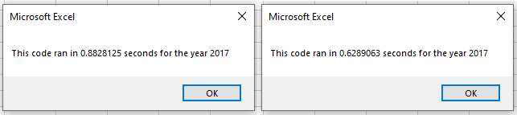
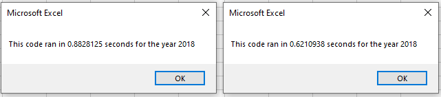

# Stocks Project with VBA
## Overview of Project
After providing Steve with a means to analyze his dataset of stocks at the click of a button, he would now like to expand that analysis to safely include thousands of stocks in the stock market opposed to dozens. To that end, my intention is to take the code already being used, and refactor it in hopes of making it more efficient.

## Results
The results of my attempt at refactoring were mixed. First of all, the refactored code was supposed to run faster than the original code. My did not, as shown below, where we have the refactored code on the left and the original on the right.

 

 

Rather, my refactored code ended up running roughly .25 seconds slower than the original code. However,  even noting this, it is important to keep in mind that this script is formatting the output of the stocks in addition to giving the volume output and return percentage. This is something the original code did not do, resulting in an output that was not visually pleasing and difficult to read. The refactored script avoids this by incorporating the formatting. Another aspect to consider relating to this is that my code failed to increased the tickers in the ticker column.

It is difficult for me to assess which parts of my code are efficient and which parts are bogging the entire process. down. I made a point to refer back to the original script when writing the code to increase the volume and when assigning the starting and closing prices.

I believe most of the issues in my script can be linked to the tickerIndex. In my code I have:
	For i = 0 To 12
	tickerIndex = tickers(i)
	tickerVolumes(i) = 0
This is what I ended up doing to connect the newly created tickerIndex variable back to the tickers array that was originally present. This code, and it being used to access the original tickers array, is possibly cumbersome in the execution of the later code to increase volume and find the starting and ending prices. That is what I suspect, at least, which is regrettable but how I was able to get the code to run.

## Summary
Overall, this was a challenge I struggled with for a variety of reasons. I feel like I understand the concept of what I was doing, but perhaps not the finer points of refactoring or what it is intended to look like, how just how much of the original script I should be altering.

In terms of advantages and disadvantages on the whole of refactoring, I would say that it is an advantage that when refactoring a code you already know exactly what it is you want the code to do. You already know how it runs. There may be bits you have to figure out, such as what to add and what to remove, but the outcome being worked towards is fully fledged out to start with, which is an advantage depending on your skillset.

The disadvantage would be that, since it is someone else's code that is being worked with, finer details may be easier to overlook or miss entirely. It also may not be obvious which lines are a necessity and which can be discarded. Also, if you delete something, and that absence leads to the code no longer being able to run, it is not something you will necessarily know right away, making it harder to identify later on.

As for pros and cons when it comes to this specific VBA script, I exemplify both of them quite well probably. I know what the script is meant to do and I know what each column is meant to contain. I know what I am meant to be doing, but the best way to execute that is another matter. My script got bungled at several points, and since I did not notice those errors, it created more work. My code was running but I left a next i in the wrong spot without realizing, so it was not running at all and I tried to fix something else that was probably running fine.

All in all, the most that can be said is it was an effort.
